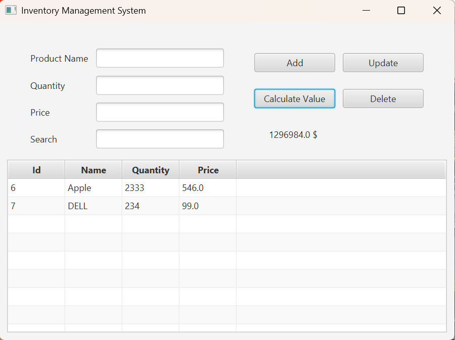

# 🌟 Inventory Management System

## 📌 Description
This is a **Java-based Inventory Management System** built using **JavaFX** and **MySQL**. The application allows users to **add, update, delete, and search for products**, while also calculating the **total stock value**.

---

## 🚀 Technologies Used
- **Java** (JavaFX for GUI)
- **MySQL** (Database)
- **JDBC** (Database connection)

---

## 📂 Project Structure
```plaintext
ma.enset.product
│── Controllers
│   └── ProductController.java
│── DAO
│   ├── DBConnection.java
│   ├── IGeneric_DAO.java
│   ├── IProduct_DAO.java
│   └── Product_DAO.java
│── entities
│   └── Product.java
│── service
│   ├── IinventoryManagementService.java
│   └── inventoryManagementService.java
│── App.java
│── resources
│   └── Product_View.fxml
```

---

## ✨ Features
✅ **Add Products**: Users can add new products with name, quantity, and price.  
✅ **Update Products**: Users can modify existing product details.  
✅ **Delete Products**: Users can remove a product from inventory.  
✅ **Search Products**: Search functionality filters products by name.  
✅ **Calculate Stock Value**: Calculates total inventory value.

---

## 🔧 Installation & Setup
### 1️⃣ Clone the repository:
```sh
   git clone https://github.com/your-repo/inventory-management.git
```

### 2️⃣ Install MySQL and create the database:
```sql
CREATE DATABASE inventory_management;
USE inventory_management;

CREATE TABLE product (
    Id BIGINT AUTO_INCREMENT PRIMARY KEY,
    Name VARCHAR(255) NOT NULL,
    Qty INT NOT NULL,
    Price DOUBLE NOT NULL
);
```

### 3️⃣ Update database credentials in `DBConnection.java`
Make sure to modify the connection settings to match your MySQL configuration.

### 4️⃣ Run the application:
```sh
   mvn clean install
   java -jar target/inventory-management.jar
```

---

## 🎯 How to Use
1. **Open the application**.
2. **Enter product details** (name, quantity, price) and click **Add**.
3. Click on a product in the table to **edit or delete**.
4. Use the **search bar** to filter products.
5. Click **Calculate Stock Value** to see total inventory value.

---

## 🖼️ Screenshots

---

## 👥 Contributors
- **Ayoub**

---

## 📜 License
This project is licensed under the **MIT License**.

---

🎉 **Happy Coding!** 🚀